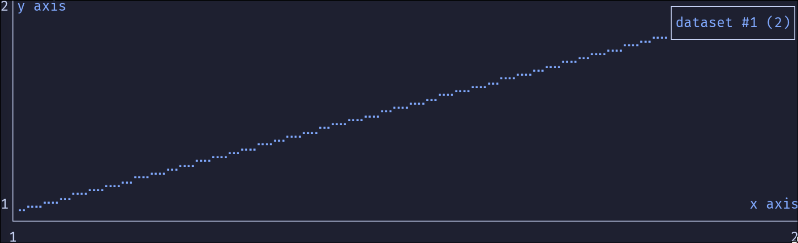

Tool to plot data directly in the terminal using pipes ```|```.

## Install
Download the latest release and place the binary somewhere in your $PATH or in the directory you want to use.

## Usage
```
// data.csv
1,2
2,2
```

```termscope data.csv``` or 

```cat data.csv | termscope```

or if you want to try : 

```echo -e "1,1\n2,2" | termscope```

You can save the data at the same time :

```termscope data.csv > save.csv``` or

```cat data.csv | tee save.csv | termscope```

This is useful if you are viewing live data.

Your terminal should look like this, to quit press any key.


